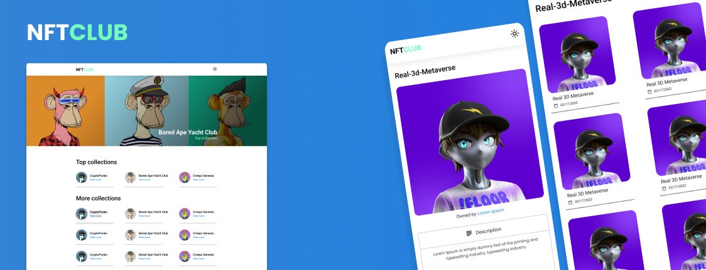

<h1 align="center">
    
</h1>

<br>

<p align="center">
  <a href="https://nft-gallery-iota.vercel.app/" target="_blank">
    click here to access the deploy
  </a>
</p>

## 💻 Project

NFTCLUB is a website capable of listing NFT collections and assets.

<br>

## 🧪 Technologies

This project was developed with the following technologies:

- Nextjs
- Styled Components
- Axios
- Opensea API

## 🚀 How to run

To start it, follow the steps below:
```bash
# Install dependencies
$ yarn

# Start the project
$ yarn dev
```

Made with 💜 by Rafael Almendra 👋 
<br />
[See my website](https://rafaelalmendra.com)
<br />
[See my linkedin](https://www.linkedin.com/in/rafaelalmendradev/)
